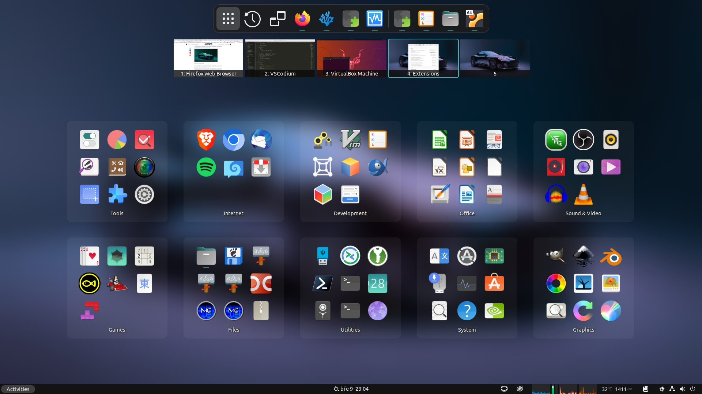

# V-Shell (Vertical Workspaces)

A GNOME Shell extension that lets you customize your GNOME Shell UX to suit your workflow, whether you like horizontally or vertically stacked workspaces.

Currently supported GNOME versions: 42 - 46

## Features
- Supports both vertically and horizontally stacked workspaces
- Customizable overview layout, appearance, behavior, shortcuts
- Customizable secondary monitor overview
- Static overview modes minimize screen content movement
- Customizable app grid and app folders - icon size, dimensions, sorting, active folder previews
- Customizable dash - icon size, appearance and behavior, workspace isolation, click and scroll actions
- Customizable search - results width, number of results, improved searching
- Customizable workspace switcher - static background
- Notification and OSD positions and behavior
- Window attention handler behavior
- Hot corner/edge position
- Customizable Super key behavior
- Keyboard and mouse shortcuts allow advanced workspace and window control
- 4 predefined and fully customizable profiles
- Supports Dash to Dock / Ubuntu Dock / Dash to Panel

## Tips and tricks

### Overview - keyboard and mouse shortcuts
|Shortcut| Description|
|--------|------------|
|`Shift + click on app icon in dash`                 | Move all windows of the application to the current workspace|
|`Secondary mouse click on the activities indicator` | Open app grid|
|`Shift + Scroll`, `Shift + Page Up/Down`            | Reorder current workspace|
|`Shift + Ctrl + Space`                              | Open V-Shell Settings window|
|`Space`                                             | Activate window search if *WSP (Window Search Provider)* is installed and enabled|

### New buttons
|Button| Description|
|------|------------|
| Close button in workspace thumbnail     | Close all windows on the workspace|
| Trash button in app folder              | Remove all icons from the folder|

## Changelog
[CHANGELOG.md](CHANGELOG.md)

## Installation

### Installation from extensions.gnome.org
The easiest way to install the latest stable release of V-Shell: go to [extensions.gnome.org](https://extensions.gnome.org/extension/5177/vertical-workspaces/) and toggle the switch.

### Installation from the latest Github release
Download the latest release archive using following command:

    wget https://github.com/G-dH/vertical-workspaces/releases/latest/download/vertical-workspaces@G-dH.github.com.zip

Install the extension (`--force` switch needs to be used only if some version of the extension is already installed):

    gnome-extensions install --force vertical-workspaces@G-dH.github.com.zip

### Installation from GitHub repository
The most recent version in the repository is the one I'm currently using and developing on my own systems, problems may occur, but usually nothing serious. The repository version may change often and doesn't updates automatically on your system. If you want to help me, use this latest version and report bugs.
You may need to install `git`, `make`, `gettext` and `glib2.0` for successful installation.
Navigate to the directory you want to download the source code and execute following commands in the terminal:

GNOME 45:

    git clone https://github.com/G-dH/vertical-workspaces.git
    cd vertical-workspaces
    make install

GNOME 42 - 44:

    git clone https://github.com/G-dH/vertical-workspaces.git
    cd vertical-workspaces
    git checkout gnome-42-44
    make install

If you get `Can't recursively copy directory` error, take a look at issue #51.

### Enabling the extension
After installation you need to enable the extension and access its settings.

- First restart GNOME Shell (`ALt` + `F2`, `r`, `Enter`, or Log Out/Log In if you use Wayland)
- Now you should see *Vertical Workspaces* extension in *Extensions* application (re-open the app if needed to load new data), where you can enable it and access its Preferences window by pressing `Settings` button.

## Credits
This extension uses customized utils and dash modules of the [Vertical Overview extension](https://github.com/RensAlthuis/vertical-overview).

## Buy me a coffee
If you like my extensions and want to keep me motivated give me some useful feedback, but you can also help me with my coffee expenses:
[buymeacoffee.com/georgdh](https://buymeacoffee.com/georgdh)
